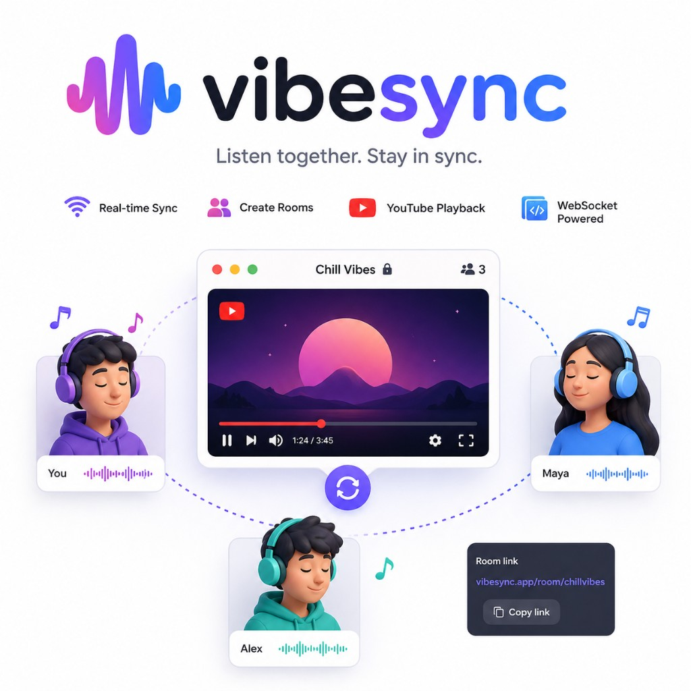

# VibeSync

**Listen together. Stay in sync.**

VibeSync is a web app for synchronized listening: shared rooms over WebSockets, optional YouTube playback, and server-cached audio. **Hosts** sign in with Google, upload MP3s to a personal cloud library, and broadcast to the room. **Listeners** join anonymously—no account required.



## Features

- **Real-time sync** — Clock sync, WebSocket relay, and aligned playback for everyone in a room.
- **Rooms** — Create or join by id; live presence and host counts.
- **Host Google sign-in** — Firebase Authentication on the client; the server verifies ID tokens and issues an app JWT for APIs and WebSocket host mode.
- **Cloud library** — Playlists and MP3 uploads (MinIO + Postgres), **100 MB per user** storage quota.
- **Listeners stay anonymous** — Join and tune in without logging in.
- **YouTube mode** — Coordinated YouTube playback when the host uses YouTube as the source.
- **Cached audio mode** (optional) — Server-side yt-dlp cache for YouTube or legacy URL imports; autonomous playback can continue after the host disconnects.

## Playback sync algorithm (confirmed in code)

This algorithm is **in place** for cached / server MP3 playback (YouTube cache, URL imports, MinIO library tracks). Implementation lives in `src/lib/clockSync.js`, `src/lib/timeline.js`, `src/hooks/useServerAudioSync.js` (HTML5 `<audio>`), and `src/hooks/useYouTubeSync.js` (YouTube embed). Thresholds and tick intervals are tuned in `src/lib/syncDevice.js`.

### Shared clock and timeline

1. **Clock sync** — `POST /api/ping` plus `serverNow` on WebSocket messages maintain an EWMA estimate of **client ↔ server skew** (`skewMs`) and **RTT / one-way delay** (`rttMs`, `owdMs`).
2. **Single timeline** — Relay state carries `positionSec`, `stampMs`, `playing`, `syncSeq`, and optional `durationSec`. Every client computes “where playback should be now” with the same formula as the server (`effectiveTimelineSec` in `src/lib/timeline.js`), using **skew-adjusted wall time**.

### Host

- The host drives the timeline: periodically publishes `positionSec` and `stampMs` from the actual player (`<audio>` in cached mode, YouTube iframe in YouTube mode).
- **Scheduled play** — on play, `stampMs` is set slightly in the future so listeners start together.
- The host does **not** run the listener correction loop; it is the **source of truth** for the shared state.

### Listeners (cached MP3)

- A periodic loop (default **500 ms** on desktop, looser on coarse-pointer devices per `syncDevice.js`) compares **expected** playback time from the relay timeline to **`audio.currentTime`**.
- **PID-style correction** — smoothed error (EWMA), a **capped integral**, and a **derivative** term combine into a control signal; **deadband**, **soft seek** (nudge with cooldown), and **hard seek** (jump) gates decide when to adjust `currentTime`.
- **RTT-aware lead** — when the file is **streamed** from a signed URL, a small **playback lead** derived from ping RTT/OWD is added so output latency does not lag the group; when the full file is buffered as a **blob**, that lead is **not** applied (tighter sync).
- **Bias learning** — persistent small offset can slowly adjust a local bias term after stable residual samples (not “physics momentum”; it corrects steady drift).
- After **`syncSeq`** changes (seek / transport), corrections are briefly suppressed so the loop does not fight a fresh host action.

### Listeners (YouTube)

- Same timeline model; `useYouTubeSync` targets the iframe API instead of `<audio>`.

## Stack

| Layer | Technology |
| ----- | ---------- |
| UI | React 19, React Router 7, Tailwind 4, Vite 5 |
| Server | Node.js 20+, **TypeScript**, Express 4, WebSocket (`ws`) |
| Database | PostgreSQL, **Prisma** |
| Object storage | **MinIO** (S3-compatible API) |
| Auth | **Firebase Auth** (Google) + **Firebase Admin** + app JWT |
| Optional cache | yt-dlp, on-disk room/host media |

## Requirements

- Node.js 20+ (LTS recommended)
- npm
- **PostgreSQL** and **MinIO** (local via Docker Compose, or your own instances)
- **Firebase project** with Google sign-in enabled (web app config + Admin service account for the server)

## Quick start

### 1. Environment

```bash
cp .env.example .env
# Edit .env — see sections below (DATABASE_URL, MinIO, Firebase, JWT_SECRET)
```

Never commit `.env`, `firebase-adminsdk.json`, or `firebaseConfig.js`. See [Secrets](#secrets).

### 2. Infrastructure (Docker)

```bash
docker compose up -d
```

Starts Postgres (`5432`) and MinIO (`9000` API, `9001` console). Align `DATABASE_URL`, `MINIO_*`, and `MINIO_PUBLIC_URL` in `.env` with your setup.

For production browser uploads, **`MINIO_PUBLIC_URL`** must be a hostname the user’s browser can reach (for example `https://minio.example.com`), not `localhost`.

### 3. App

```bash
npm install
npm run db:migrate
npm run dev
```

- **API + WebSocket:** `http://127.0.0.1:3847` (default `PORT`)
- **Vite dev UI:** `http://localhost:5173` (proxies `/api` and `/ws` to the server)

Use the Vite URL during development.

### 4. Firebase (hosts)

**Client (public)** — set in `.env` with the `VITE_FIREBASE_*` prefix from the Firebase console (Project settings → Your apps → Web). Enable the **Google** provider and add your domains under **Authorized domains** (`localhost`, production host).

**Server (private)** — download a Firebase **service account** JSON and either:

- set `GOOGLE_APPLICATION_CREDENTIALS=/path/to/firebase-adminsdk.json`, or  
- place the file at `~/.config/syncwatch/firebase-adminsdk.json`

Do not commit the service account file.

## Scripts

| Command | Description |
| ------- | ----------- |
| `npm run dev` | TypeScript server (`tsx watch`) + Vite |
| `npm run dev:server` | API + WebSocket only |
| `npm run build:server` | Compile server → `build/server/` |
| `npm run build` | Vite production build → `dist/` |
| `npm run build:all` | Server + client build |
| `npm run build:deploy` | `build:all`, migrate DB, restart server (`scripts/deploy-local.sh`) |
| `npm run start` | Production: `node build/server/index.js` + static `dist/` |
| `npm run db:migrate` | Apply Prisma migrations (`prisma migrate deploy`) |
| `npm run db:migrate:dev` | Create/apply migrations in development |
| `npm run lint` | ESLint |
| `npm run preview` | Preview Vite build only |

## Development

```bash
npm run dev
```

Open the Vite URL (for example `http://localhost:5173`). As **host**, use **Sign in with Google** before broadcasting; the relay only treats you as host when the app JWT is valid.

## Production

```bash
npm run build:deploy
```

Or manually:

```bash
npm run build:all
npm run db:migrate
NODE_ENV=production npm run start
```

The server serves `dist/` when `NODE_ENV=production` and listens on `127.0.0.1:$PORT` by default. Put a reverse proxy (nginx, Caddy, etc.) in front for HTTPS and set `PUBLIC_APP_ORIGIN` to your public site URL.

See **[docs/DEPLOY.md](docs/DEPLOY.md)** for production checklist, MinIO/Firebase setup, nginx example, and troubleshooting.

## Routes

| Path | Description |
| ---- | ----------- |
| `/` | Listen / room experience |
| `/how-it-works` | How it works (markdown) |

## API overview

| Endpoint | Purpose |
| -------- | ------- |
| `POST /api/auth/session` | Exchange Firebase ID token → app JWT |
| `GET /api/auth/me` | Current user (Bearer app JWT) |
| `POST /api/me/playlists/...` | Playlists, presigned upload, complete |
| `GET /api/rooms/:roomId/audio` | Signed playback (YouTube cache, URL imports, or `lib_*` library tracks) |
| `WS /ws` | Room relay; host join includes `authToken` |

## Architecture (host upload)

1. Host signs in with Google → Firebase ID token → `POST /api/auth/session` → app JWT.  
2. Host requests presigned PUT → uploads MP3 to MinIO → `complete` updates Postgres and quota.  
3. Host selects a library track (`lib_<id>`) in the room; server streams from MinIO via signed `/audio` URLs.  
4. Listeners receive relay state only; no login.

## Secrets

Keep out of git (see `.gitignore`):

- `.env` — database passwords, `JWT_SECRET`, MinIO keys, etc.
- Firebase Admin service account JSON  
- `firebaseConfig.js` (use `VITE_FIREBASE_*` in `.env` instead)  
- `server.log`, `data/`, `build/`, `dist/`

`.env.example` documents variable names with safe placeholders only.

## Optional: server-cached YouTube audio

Set `SERVER_AUDIO_ENABLED=true` and configure `YT_DLP_BIN` (and often `YT_DLP_COOKIES` on VPS IPs). See comments in `.env.example`. Confirm you have rights to cache and redistribute audio for your use case.
