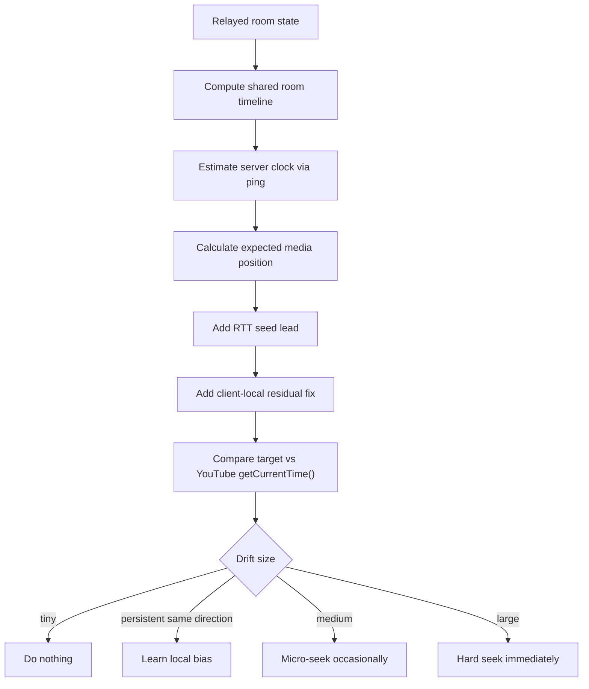
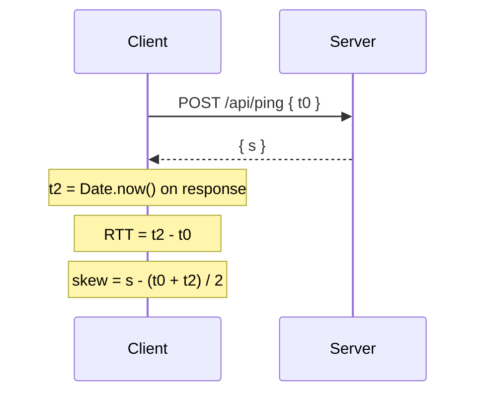
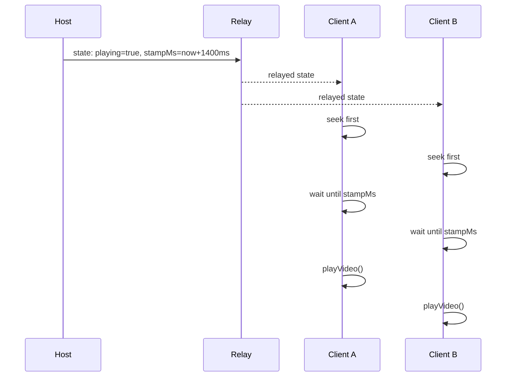
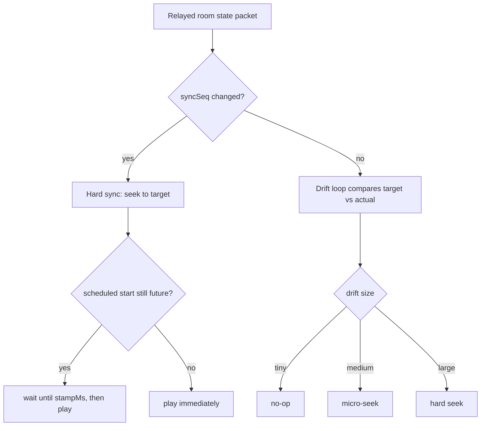
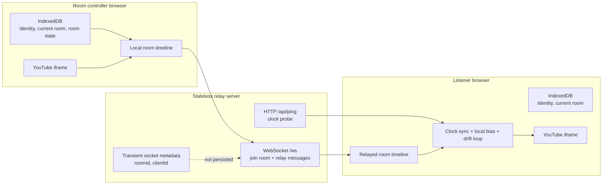

# How It Works

This page starts with the playback syncing algorithm, then shows the stateless room architecture that carries those sync messages.

## Syncing Algorithm Breakdown

The system is a hybrid sync controller. It does not trust WebSocket delivery timing alone. WebSocket gets everyone the same room state, then each client continuously corrects its own YouTube player.



## Timeline Model

The room creator's browser is the authority for that room. Every relayed state packet describes a timeline anchor:

| Field | Meaning |
| --- | --- |
| `videoId` | Current YouTube video id |
| `playing` | Whether the timeline is moving |
| `positionSec` | Media position at the anchor |
| `stampMs` | Server clock timestamp for that anchor |
| `syncSeq` | Incremented on hard events like play, pause, seek, load |

When playing, the expected room position is:

$$
\text{expectedPosition} =
\text{positionSec} + \frac{\max(0, \text{estimatedNow} - \text{stampMs})}{1000}
$$

```txt
expectedPosition = positionSec + max(0, serverNow - stampMs) / 1000
```

When paused, the expected position remains `positionSec`.

## 1. Clock Sync

Browsers do not share the same clock, so each client estimates relay-server time and uses that as a common reference.



The client smooths these measurements with EWMA:

$$
\theta \approx s - \frac{t_0 + t_2}{2}
$$

$$
\text{RTT} = t_2 - t_0
$$

$$
\text{ping} \approx \frac{\text{RTT}}{2}
$$

```txt
skewMs = alpha * skewSample + (1 - alpha) * skewMs
rttMs  = alpha * rttSample  + (1 - alpha) * rttMs
pingMs = rttMs / 2
```

The client estimates server time as:

$$
\widehat{T}_{server} = Date.now() + \text{skewMs}
$$

## 2. Scheduled Start

Instant "play now" messages arrive at different times on different clients. Instead, the room controller schedules play slightly in the future.



If a client receives the event late, it seeks to the currently expected position and starts immediately.

## 3. RTT Seed Lead

The client uses RTT only as a small seed. It does not assume RTT can explain all YouTube/device delay.

$$
\text{seedLead} = 0.04 + 0.08 \cdot \text{RTT} + 0.04 \cdot \text{ping}
$$

where time values are in seconds and lead is bounded to:

$$
0.04 \le \text{seedLead} \le 0.18
$$

This seed helps with normal network and iframe start delay, but it is deliberately small.

## 4. Client-Local Residual Fix

Some delay is not WebSocket delay. It can come from the YouTube iframe, browser scheduling, decoding, output device latency, or tab throttling. This appears as a constant residual drift on one client.

Each client learns a local bias from raw room drift:

$$
\text{serverError} =
\text{serverExpectedPosition} - \text{player.getCurrentTime()}
$$

If `serverError` stays in the same direction for several samples, the browser updates a private bias:

$$
\text{localBias} \leftarrow
clamp(\text{localBias} + \Delta,\ -0.8,\ 1.0)
$$

This is never sent to the server and never sent to other users. It is only this browser correcting its own constant output delay.

The final listener target is:

$$
\text{target} =
\text{serverExpectedPosition} + \text{seedLead} + \text{localBias}
$$

## 5. Iterative Drift Correction

While tuned in, each client runs a loop every `500ms`:

$$
\text{error} = \text{target} - \text{actual}
$$

where:

$$
\text{actual} = \text{player.getCurrentTime()}
$$

The loop is PID-inspired, but adapted for YouTube because the iframe does not provide reliable fine-grained playback-rate control.

$$
\text{driftEwma} =
0.35 \cdot \text{error} + 0.65 \cdot \text{previousDrift}
$$

$$
\text{integral} =
clamp(\text{integral} + \text{driftEwma} \cdot 0.7,\ -1.4,\ 1.4)
$$

$$
\text{derivative} =
\frac{\text{driftEwma} - \text{previousDrift}}{0.7}
$$

$$
\text{control} =
0.78 \cdot \text{driftEwma}
+ 0.05 \cdot \text{integral}
+ 0.16 \cdot \text{derivative}
$$

Correction policy:

| Drift | Action |
| --- | --- |
| Tiny | Do nothing |
| Medium | Occasional micro-seek |
| Large | Immediate hard seek |

This makes sync converge iteratively without constantly disturbing playback.

## Event Flow



## Stateless Architecture

The backend does not store rooms or playback state. It only keeps temporary WebSocket metadata for currently connected sockets.



## IndexedDB Storage

Each browser stores only its own local information:

| Key | Purpose |
| --- | --- |
| `identity` | Stable browser client id |
| `currentRoom` | The room this browser should join on load |
| `rooms` | Recently known local rooms |
| `roomState:<roomId>` | Playback state for rooms this browser controls |

The relay server does not save these values.

## WebSocket Relay

The relay supports two message types:

| Message | Purpose |
| --- | --- |
| `join` | Attach a socket to a room id |
| `relay` | Forward an event to other sockets in that room |

Presence counts are computed from live sockets only. If all sockets disconnect, the server forgets the room.

## Why Not True PID Playback Rate?

A true PID loop works best when the player can smoothly adjust playback speed, for example `0.997x` or `1.003x`. The YouTube iframe API does not reliably support those tiny rate changes; it mostly exposes coarse rates.

So the system uses a hybrid:

- scheduled starts for clean initial alignment
- smoothed clock sync from ping/RTT
- bounded playback lead
- PID-inspired drift estimation
- YouTube-safe seek corrections

That is the most practical approach for a YouTube iframe.
